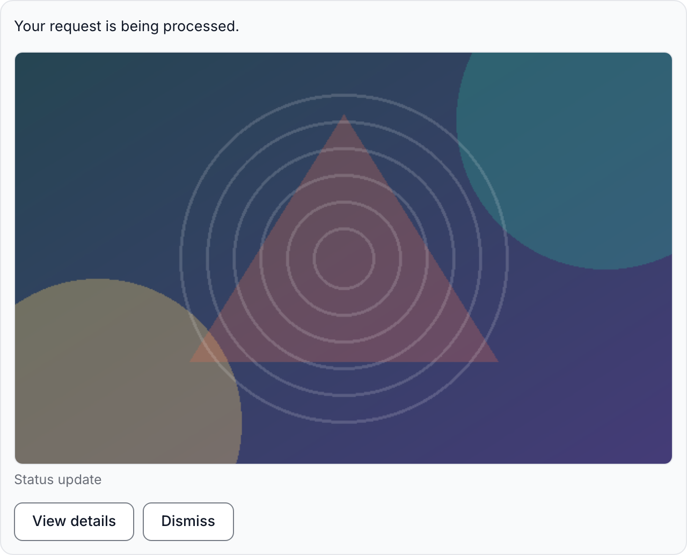

The web channel hosts a standalone chat page for anonymous visitors: it serves
the page, mints a session cookie, and bridges each message through the
conversation bridge — no vendor account, and no account for the visitor. Unlike
the messaging channels it is both the chat surface **and** the transport, and it
holds no vendor secret: the doors are public and authenticate the visitor by the
session cookie alone.

## Enable it

```yaml manifest.yml
channel_modules:
  - tai42_channel_web
```

The only backing store is a plugin-owned Redis holding the session
registrations, the transcripts, and the pending-question records
(`CHANNEL_WEB_REDIS_URL`, falling back per-field to the shared `TAI_DEFAULT_*`
namespace).

## Configuration

The `CHANNEL_WEB_` env group. Defaults suit a typical deployment; the transcript,
stream, and entry-gate caps are the tunables.

| Variable | Default | Effect |
| --- | --- | --- |
| `CHANNEL_WEB_REDIS_URL` | unset | Connection for the session, transcript, and pending-question store. |
| `CHANNEL_WEB_PAGE_TITLE` | `Chat` | The chat page's `<title>`. |
| `CHANNEL_WEB_HTTP_TIMEOUT_SECONDS` | `30` | Timeout for the loopback answer forward to the interactions callback door. |
| `CHANNEL_WEB_SESSION_COOKIE_SECURE` | `true` | `Secure` on the session cookie. Set `false` only where the page is served over plain http (dev/e2e). |
| `CHANNEL_WEB_SESSION_TTL_SECONDS` | `2592000` | Lifetime of the session cookie and the server-side registration, refreshed on every resolving door. |
| `CHANNEL_WEB_SESSION_PENDING_TTL_SECONDS` | `600` | Lifetime a just-minted registration gets before its cookie first returns. |
| `CHANNEL_WEB_TRANSCRIPT_MAX_ENTRIES` | `1000` | `MAXLEN` cap on the browser-replay transcript stream (trimmed exactly). |
| `CHANNEL_WEB_TRANSCRIPT_TTL_SECONDS` | `2592000` | Transcript expiry, refreshed on every append. |
| `CHANNEL_WEB_BACKLOG_BATCH_ENTRIES` | `200` | Transcript entries read per page when a stream replays a backlog. |
| `CHANNEL_WEB_KEEPALIVE_SECONDS` | `15` | Seconds between SSE keepalive frames, and the live-tail block window. |
| `CHANNEL_WEB_BLOCKING_GRACE_SECONDS` | `5` | Grace added to the keepalive window bounding a black-holed Redis read. |
| `CHANNEL_WEB_MAX_STREAMS_PER_VISITOR` | `4` | Concurrent SSE streams admitted for one visitor. |
| `CHANNEL_WEB_MAX_STREAMS_TOTAL` | `500` | Concurrent SSE streams admitted across one process. |
| `CHANNEL_WEB_MAX_BODY_BYTES` | `65536` | Bounded read cap on the POST doors (over-cap is a loud 413). |
| `CHANNEL_WEB_MAX_ANSWER_RESTORES` | `5` | How often one question's record may be re-forwarded after a refused/failed forward. |
| `CHANNEL_WEB_ENTRY_ATTEMPTS_PER_WINDOW` | `10` | Entry-code guesses one client may make against a gated route per window. |
| `CHANNEL_WEB_ENTRY_THROTTLE_WINDOW_SECONDS` | `300` | Length of that throttle window. |

## Create a route and open the page

A web route binds an **identity** — an arbitrary name you choose — to the turn
that answers it.

```bash
tai conversations create web-desk \
  --door channel --target-name chat --execution-key chat-bot \
  --channel web --identity desk
```

The route's turn runs as the `--execution-key` you bind here; mint a
least-privilege key scoped to just what the desk needs, the same way a phone
channel does in [WhatsApp to an agent](/guides/whatsapp-to-agent).

Send visitors to the chat page for that identity:

```
https://<your deployment>/api/channels/web/chat/desk
```

## Agent-sent cards and lists

A `notify_user` addressed at a web visitor carries richer content than plain text. A
notification's `media` renders as a **media card**: the message text and the media items,
each optionally captioned — absolute-`https` images (an `http:` or `data:` image is refused loudly
— the page renders an image only from an https source) and outbound links, which ride the
card as safe link elements rather than folded into the body text. A notification's `options`
renders a **tappable option list** (at most 10 options); a tap sends the option's own text
through the message door as an ordinary visitor message, so it enters the conversation
exactly as if the visitor had typed it. `options` may combine with `media` (a card with a
list). Templates are **not** supported — a template is a vendor construct, refused loudly on
this channel.



<Warning>
Rendering a remote card image makes the visitor's browser fetch it from the image
host, which reveals the visitor's IP address and request timing to that host (the
page sends no `Referer`). Point card images only at a host the visitor may reveal
themselves to.
</Warning>

## Link parameters

Query parameters on the chat page URL are **captured with the visitor's session**
and delivered to the turn. A route whose target is a **tool** receives them on
its payload under a `params` key — string values, reachable from `payload_expr`
as `.params.<name>`:

```
https://<your deployment>/api/channels/web/chat/desk?topic=news&ref=abc
```

Bounds are enforced at the door — **at most 16** parameters, each key matching
`^[A-Za-z0-9_-]{1,64}$`, each value at most **512** characters, the whole set at
most **2048** bytes — and a violation is a refused page, never a silent trim. The
names `tai_pair` and `tai_entry` are reserved and stripped before storage. A later
navigation carrying parameters replaces the stored set; starting a new
conversation clears it. Parameter values are never logged, and `params` is
present on the payload only when the entry carried parameters.

<Warning>
A link parameter is **transport, nothing more** — no signature, no expiry, no
interpretation. When a flow must *trust* a value, it issues its own secret token,
delivers it in the link, and checks it in its own store. jq gating in
`payload_expr` runs before the tool does:

```bash
--payload-expr 'if .params.key then {example_config_kwargs: {message: .message, token: .params.key}} else error("no key") end'
```
</Warning>

## Entry gate

A web route can be **gated**: the chat page is served only to a navigation
carrying a live entry code on `?tai_entry=<code>`. An ungated route is unchanged
— the gate is opt-in per identity.

Entry codes are operator-minted, multi-use, optionally expiring, revocable, and
**hashed at rest**: only a code's hash is stored, and the raw code exists only in
the mint response and the visitor's link. A missing, unknown, expired, or revoked
code — or a client that has guessed too often — is refused with **one** page,
HTTP `403`, one wording: the gate is no oracle. The gate is checked only where a
session is minted (opening the page or starting a new conversation); an existing
session is admitted without a code.

<Warning>
The gate admits **whoever holds a live code** — never who they are. Forwarding
the link forwards entry. And revocation cuts **new** entries only: a visitor
already admitted keeps a live session until its own TTL lapses. To cut off a live
visitor you end their session, not the code they entered with.
</Warning>

### Operating the gate

Four authed management doors run the gate's lifecycle — call them with a platform
API key.

<Steps>
  <Step title="Enable the gate">
    ```bash
    curl -sS -X PUT "$TAI_BASE_URL/api/channels/web/gates/desk" \
      -H "X-Api-Key: $ADMIN_KEY" -H 'Content-Type: application/json' \
      -d '{"enabled": true}'
    ```
  </Step>
  <Step title="Mint a code and distribute the link">
    The raw `code` is returned **once**; only its hash (`code_id`) is stored.

    ```bash
    curl -sS -X POST "$TAI_BASE_URL/api/channels/web/gates/desk/codes" \
      -H "X-Api-Key: $ADMIN_KEY" -H 'Content-Type: application/json' \
      -d '{"label": "spring-cohort", "expires_at": "2026-12-31T00:00:00Z"}'
    ```

    Distribute the chat URL with `?tai_entry=<code>` appended. A code is
    multi-use: everyone holding the link enters.
  </Step>
  <Step title="List codes">
    ```bash
    curl -sS "$TAI_BASE_URL/api/channels/web/gates/desk" -H "X-Api-Key: $ADMIN_KEY"
    ```

    Codes are listed by hash — a raw code is never re-readable.
  </Step>
  <Step title="Expire or revoke">
    ```bash
    curl -sS -X DELETE "$TAI_BASE_URL/api/channels/web/gates/desk/codes/<code_id>" \
      -H "X-Api-Key: $ADMIN_KEY"
    ```
  </Step>
</Steps>

## See also

- [Client conversations](/concepts/client-conversations) — the bridge model.
- [Conversation bridge](/reference/conversation-bridge) — the `params` payload key, route CRUD, and
  every setting.
